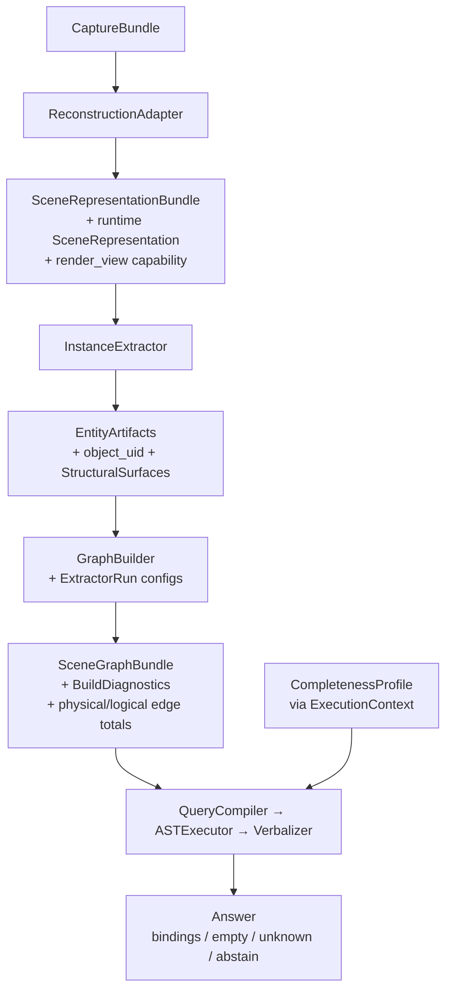

# Phase 1 — Final Accounting

> [!success] Status: **complete**
> All 13 task items landed. Phase 1 exit gate (`tools/phase1_exit_gate.py`) is green: 0 cross-stage `_internal` imports, both artifact gates pass on canonical Replica, **165/165 tests across 9 suites**.

Related: [[phase0_design]] (the frozen contracts this phase implemented).

---

## Quick stats

| | |
|---|---|
| Tasks complete | 13 / 13 |
| Test suites | 9 |
| Tests passing | **165 / 165** |
| Stage packages | 8 (`common`, `adapters`, `representations`, `extractors`, `graph`, `reasoner`, `eval`, `benchmark`) |
| Cross-stage `_internal` imports | 0 |
| Compat-mode edge reproduction | 5,414 / 5,414 (byte-exact) |
| Sparse-mode density on Replica | 10.71 / 14 (cap) |

---

## Architecture (implemented)



Five swap points, each independently testable. The `empty` vs `unknown` decision lives at the executor and reads an externally-calibrated `CompletenessProfile` — no stage scores itself.

---

## Task accounting

- [x] **P1.01** Base interfaces & dataclasses ([§3–§5 of phase0_design](phase0_design.md))
- [x] **P1.02** Schema round-trip tests (15/15)
- [x] **P1.03** Bundle correspondence — `shared_source_ref`, `iou_match`, `manual` (24/24)
- [x] **P1.04** Replica oracle adapter + mesh representation (15/15)
- [x] **P1.05** Replica oracle instance extractor (15/15)
- [x] **P1.06** Directional + proximity extractors, compat + sparse modes (20/20)
- [x] **P1.07** GraphBuilder (17/17)
- [x] **P1.08** Compat reproduction gate (artifact: `scenes/replica_room_0/eval/oracle_adapter_repro_diff.json`)
- [x] **P1.09** Sparse density gate (artifact: `scenes/replica_room_0/eval/sparse_density_report.json`)
- [x] **P1.10** Rules compiler + executor + verbalizer + router (22/22)
- [x] **P1.11** Benchmark fixes — schema v0.1 → v0.2, `any_of_subset`, scalar scoring (38/38)
- [x] **P1.11.post** v0.1 → v0.2 comparison artifact (`runs/p1_11_post/comparison.json`)
- [x] **P1.12** Bathroom wrapper + Phase 1 exit gate (7/7)

---

## Test suites

| Suite | File | Count |
|---|---|---|
| Schema round-trip | `tests/schema/test_round_trip.py` | 15 |
| Oracle pipeline | `tests/oracle_replica/test_oracle_pipeline.py` | 15 |
| Relation extractors | `tests/relations/test_directional_proximity.py` | 20 |
| GraphBuilder | `tests/graph/test_builder.py` | 17 |
| Benchmark runner + schema | `tests/benchmark/test_runner_and_schema.py` | 38 |
| Bundle correspondence | `tests/eval/test_bundle_correspondence.py` | 24 |
| Phase 1 artifact gates | `tests/gates/test_phase1_gates.py` | 7 |
| Reasoner pipeline | `tests/reasoner/test_reasoner_pipeline.py` | 22 |
| Bathroom wrapper | `tests/fixtures/test_bathroom_wrapper.py` | 7 |
| **Total** | | **165** |

---

## Stage modules (Phase 1 deliverables)

```
common/
  types.py          — Vec3, Quaternion, Plane, OrientedBBox, CameraPose, SceneFrame, JSON
  serde.py          — shared primitive encoders; SchemaVersionError; npy sidecars
  equality.py       — array_aware_equal (dtype + shape + values; tuple/list significant)

adapters/
  base.py           — ReconstructionAdapter Protocol, CaptureBundle, ReconstructionConfig
  oracle_replica.py — OracleReplicaAdapter (wraps pre-imported Replica state)

representations/
  base.py           — SceneRepresentationBundle (data) + SceneRepresentation (runtime)
  mesh.py           — MeshRepresentation; Phase 1 render_view raises NotImplementedError
  serde.py          — bundle ↔ JSON

extractors/
  base.py           — InstanceExtractor Protocol, EntityArtifacts, StructuralSurface (with surface_uid)
  oracle_replica.py — OracleReplicaExtractor (73 entities on Replica, stable object_uids)
  serde.py          — bundle ↔ JSON + embedding .npy sidecars

graph/
  schema.py         — GraphRef (entity|surface), Node, Edge, SceneGraphBundle, BuildDiagnostics
  serde.py          — bundle ↔ JSON
  builder.py        — GraphBuilder (mode validation, duplicate rejection, density guardrail)
  relations/
    base.py         — RelationExtractor Protocol; count_logical_edges; edge_key
    directional.py  — DirectionalExtractor (compat + sparse, separate code paths)
    proximity.py    — ProximityExtractor (compat + sparse)

reasoner/
  ast.py            — QueryAST primitives (Aggregation, EdgeConstraint, Variable, EntityRef)
  base.py           — QueryCompiler / ASTExecutor / Verbalizer Protocols
                      + CompletenessProfile + ExecutionContext + Answer
  serde.py          — CompletenessProfile + ExecutionContext ↔ JSON
  compiler_rules.py — RulesCompiler (regex templates, ported from tiny_graph_demo)
  executor.py       — RulesExecutor (handles canonical/inverse/symmetric storage transparently)
  verbalizer.py     — StandardVerbalizer (distinct strings for empty vs unknown)
  router.py         — Router (compiler → executor → verbalizer; LLM stub for Phase 4)

eval/
  bundle_correspondence.py — shared_source_ref, iou_match, manual
  fixtures/
    bathroom_v1.py  — load_bathroom_bundle (regression smoke fixture)

benchmark/
  schema.py         — Question (v0.2: + expected_count, expected_yes_no); validate_question
  runner.py         — score_output (scalar dispatch; any_of_subset fix)
  categories.py     — unchanged
```

---

## Key contracts (Phase 1)

> [!info] Identity (per-bundle, not cross-bundle)
> `EntityIdentity.object_uid` is immutable **within** an `EntityArtifacts` bundle only. Cross-bundle comparison requires an explicit [[#Bundle correspondence|BundleCorrespondence]]. Edges use typed `GraphRef(kind="entity"|"surface", uid=...)` on both sides.

> [!info] empty vs unknown
> `oracle` source → `empty` when no bindings. `unknown` source → `unknown`. `measured` source → `empty` iff `min(touched recall priors) ≥ empty_recall_threshold`, else `unknown`. The executor reads `CompletenessProfile` via `ExecutionContext` — extractor diagnostics stay observational.

> [!info] Compat vs sparse
> `compat` is a faithful port of `relations/compute.py`; the gate is **byte-for-byte reproduction** of the 5,414-edge legacy artifact. `sparse` is the desired graph: canonical-only directional, NEAR once per pair, density `logical / entity ≤ 14`. Compat and sparse are physically separate functions; no shared branch logic.

> [!info] Benchmark semantics changed (not a model improvement)
> P1.11 fixed `any_of_subset` (now requires zero false positives in addition to ≥ 1 hit) and added scalar `count` / `yes_no` scoring. v0.1 metrics from prior runs are **NOT** comparable to v0.2. See `runs/p1_11_post/comparison.json` for the documented delta.

---

## Phase 1 artifact gates

| Gate | Path | Verdict |
|---|---|---|
| Compat reproduction | `scenes/replica_room_0/eval/oracle_adapter_repro_diff.json` | `pass: true` — `missing: []`, `extra: []`, 5414/5414 |
| Sparse density | `scenes/replica_room_0/eval/sparse_density_report.json` | `pass: true` — ratio 10.71, limit 14 |
| v0.1 → v0.2 comparison | `runs/p1_11_post/comparison.json` | replica policy_satisfied_rate 0.5→0.1 (v1) and 0.7→0.1 (v2), all attributed `any_of_subset_fix` |

---

## Real findings recorded along the way

1. **Sparse defaults are Replica-calibrated, not generalization evidence.** `DirectionalConfig.sparse_max_distance=2.5` was chosen because room_0 (73 entities) lands at 14.52 with 3.0 — over the guardrail. 2.5 fits. Phase 3 measured precision/recall will replace this density heuristic.
2. **Cabinet sits against a wall** in Replica room_0 — has 0 `LEFT_OF` neighbors. Reasoner test switched to `NEAR(cabinet)` which has 6 matches.
3. **Two Replica oracle reruns** match all 73 entities via both `iou_match` (IoU=1.0 across the board) and `shared_source_ref` — confirms the identity contract holds across processes.
4. **No sink in Replica** — `"What is left of the sink?"` produces a sensible `empty` answer under oracle context and `unknown` under unknown context. This is the canonical P1.10 exit demo.

---

## Phase 2 candidates

Per [phase0_design.md §11](phase0_design.md):

- Importer extension: structural surfaces (floor / wall / ceiling) + world-frame OBBs in `extractors/oracle_replica.py`.
- Spike at least one learned reconstruction-and-extraction backend trio against the §10 adoption gates (G1–G6).
- Begin hand-labeled relation ground truth for Replica (sampling protocol in §8.1) so the density heuristic can be replaced by measured precision/recall.

---

## Runnable entry points

| Purpose | Command |
|---|---|
| Run the blocking Phase 1 exit gate | `python tools/phase1_exit_gate.py` |
| Re-emit just the artifact gates | `python tools/phase1_gates.py` |
| Re-emit v0.1 → v0.2 comparison | `python tools/compare_runner_semantics.py` |
| Run any single test suite | `python tests/<suite>/test_*.py` |
