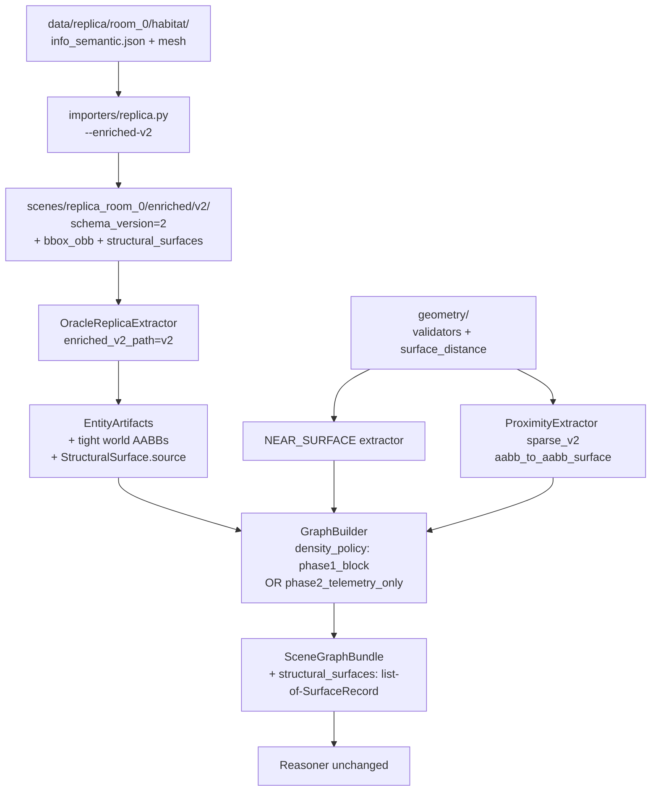

# Phase 2 — Geometry Enrichment Final Accounting

> [!success] Status: **complete**
> All 10 task items (P2.01–P2.10) landed. **Phase 2 exit gate** is green: 6/6 blocking gates pass; G6 records combined density 16.151/entity as telemetry only (no silent cap raise). **Phase 1 exit gate stays byte-equal** (compat reproduction 5414/5414).

Related: [[phase0_design]] (frozen contracts) · [[phase1_summary]] (what Phase 1 shipped) · [[phase2_plan]] (the plan this phase executed).

---

## Quick stats

| | |
|---|---|
| Tasks complete | 10 / 10 (P2.01–P2.10) |
| New test suites | 7 (importers, geometry, relations, schema, oracle_replica, tools) |
| Tests across the repo | **300+ / 300+ passing** |
| Phase 1 byte-equality | Preserved (5414/5414 edges; bundle_hash frozen) |
| Phase 2 blocking gates (G1–G5, G7) | 6 / 6 PASS |
| Phase 2 telemetry gate (G6) | recorded 16.151/entity (cap 14; over) |
| New code files | 9 (`geometry/*`, `graph/relations/surface.py`, importer extensions, extractor extensions, `SurfaceRecord`) |
| New tools | 5 (verifier + 4 telemetry/gate scripts) |
| Frozen smoke list | 12 cases (6 near + 6 not_near) on real Replica room_0 |

---

## What changed in the architecture



Five-stage pipeline still intact. Phase 2 adds a parallel **enriched-v2 read path** in the importer + extractor (default behavior byte-frozen) plus a new `geometry/` package of pure math and a new `NEAR_SURFACE` relation family.

---

## Task accounting

| Task | What landed | Tests |
|---|---|---|
| **P2.01** Raw data acquisition | `tools/verify_replica_inputs.py` (sha256-pinned). Verifier exits 0 only when local raw inputs match the lock file. No silent canonical fallback per Q1. | inline-runnable; lock file committed |
| **P2.02** OBB importer extension | `importers/replica.py --enriched-v2`: emits `bbox_obb` + tight world-frame AABBs to a versioned path (`scenes/.../enriched/v2/`). Phase 1 outputs untouched (A1). | 4 / 4 (`test_replica_enriched_v2.py`) |
| **P2.03** Structural surfaces | Habitat-label extraction of floor/wall/ceiling. UIDs by Habitat ID (`floor_25`, `wall_89_xminus`). Interior-facing normals via floor-face-centroid reference (NOT object-centroid `room_bbox`). Polygons with deterministic winding `dot(cross(p1-p0, p2-p0), normal) > 0`. RANSAC explicitly out of scope. | 13 / 13 (`test_replica_enriched_v2_structural.py`) |
| **P2.04** Geometry validators | `geometry/validators.py`: `validate_gravity_alignment`, `validate_obb_sanity`, `validate_plane_normalized`, `validate_surface_extents`, `validate_surface_source` (A7), `validate_canonical_surface_set` (A7), `validate_deterministic_hash`. Plus `sha256_of_bytes`. Hardened to reject non-finite bounds, inverted ranges, degenerate polygons. | 42 / 42 (`test_validators.py`) |
| **P2.05** Round-trip enriched data | Real-Replica round-trip via `dump_entity_artifacts` ↔ `load_entity_artifacts`. `source` survives. Schema-version bump enforced. v1 manifest load now raises `SchemaVersionError`. | 9 / 9 (`test_enriched_v2_round_trip.py`) |
| **P2.06** Extractor read path | `OracleReplicaExtractor(enriched_v2_path=...)` opt-in. Default mode preserves Phase 1 bundle_hash bit-identically (4-key payload). v2 mode reads tight AABBs, populates `bbox_obb`, surfaces structural surfaces with `source`. `StructuralSurface` dataclass gained `source` field (A7); entity-artifact serde schema bumped 1 → 2. | 15 / 15 (`test_enriched_v2_read_path.py`) |
| **P2.07** Surface-distance helpers | `geometry/surface_distance.py`: `point_to_plane` (signed), `point_to_aabb`, `aabb_to_aabb_surface` (Euclidean norm of positive axis gaps — A4), `bbox_to_plane` (non-negative; 0 on intersect). `obb_to_obb_surface` DEFERRED (A5). Hardened to reject malformed geometry. | 28 / 28 (`test_surface_distance.py`) |
| **P2.08** sparse_v2 NEAR | Physically separate `extract_sparse_v2` function using `aabb_to_aabb_surface`. v1 byte-frozen. v2 edges carry `extractor_version="0.2-sparse_v2"` (truthful) + `evidence["distance_metric"]="aabb_surface"`. Default `sparse_version=1` preserves Phase 1 graph hashes via `hash_omit_if_default`. Telemetry artifact written. | 13 / 13 (`test_proximity_sparse_v2.py`) |
| **P2.09** NEAR_SURFACE extractor | `graph/relations/surface.py`: `SurfaceProximityExtractor` emits `NEAR_SURFACE(entity, surface)` via `GraphRef(kind="surface")`. Uses `bbox_to_plane ≤ threshold` per-surface-type (0.05 / 0.30 / 0.10 m). Canonical path skips `synth_bbox_fallback` with recorded `EdgeRejection` diagnostics. Frozen smoke list (12 cases) verified BEFORE extractor code landed. | 21 / 21 (`test_near_surface.py`) |
| **P2.10** Exit gate + C1 | Graph-level `SurfaceRecord` (C1). `SceneGraphBundle.structural_surfaces`. Builder retains full surface set + rejects unknown UIDs (G7). New `density_policy` parameter (`phase1_block` default; `phase2_telemetry_only` opt-in). Consolidated `tools/phase2_exit_gate.py` runs G1–G7 → deterministic artifact (no timestamp). | 6 new (`test_builder.py`); G1–G7 all green |

---

## The eight required amendments (final status)

| # | Amendment | Where it landed | Status |
|---|---|---|---|
| **A1** | Don't overwrite Phase 1 replay fixture | `importers/replica.py:enriched_v2` writes to versioned path | ✅ Phase 1 reads stay byte-identical |
| **A2** | Fix NEAR direction expectation | P2.08 telemetry: surface ≤ centroid → v2 superset of v1 | ✅ Verified on Replica (113 + 299 new) |
| **A3** | `room_bbox` not canonical fallback | Walls oriented via floor-face centroid; synth fallback experiment-only | ✅ Excluded from G1 + G5 canonical gates |
| **A4** | Tighten geometry math | `bbox_to_plane` non-negative; `aabb_to_aabb_surface` Euclidean norm | ✅ Diagonal-separation regression test green |
| **A5** | Reject closest-corner OBB-OBB | Phase 2 uses exact AABB surface distance | ✅ `obb_to_obb_surface` not present in `geometry/` |
| **A6** | Extend builder | Retains all surfaces; rejects unknown UIDs (G7) | ✅ Tests + Phase 2 gate confirm |
| **A7** | Per-surface provenance | `source` on `StructuralSurface`, `SurfaceRecord`, edge evidence | ✅ Round-trip + validators verify |
| **A8** | G5 negative controls | 12-case smoke list (6 near + 6 not_near) frozen before extractor | ✅ All 12 pass on real Replica |

---

## C1 — graph-level `SurfaceRecord`

> [!important] C1 was the final blocker before P2.10 integration.
> Before C1, `SceneGraphBundle.structural_surface_refs: list[str]` only carried UIDs derived from the edge set. A6/A7 required provenance to survive into the graph — so we added a dedicated record type, NOT a node.

```python
# graph/schema.py
@dataclass(frozen=True)
class SurfaceRecord:
    uid: str
    surface_type: Literal["floor", "wall", "ceiling"]
    plane: Plane
    polygon: list[Vec3] | None
    source: Literal["habitat_label", "mesh_ransac", "synth_bbox_fallback"]
    confidence: float

@dataclass(frozen=True)
class SceneGraphBundle:
    # ... existing fields ...
    structural_surface_refs: list[str]
    structural_surfaces: list[SurfaceRecord] = field(default_factory=list)  # NEW
```

The builder populates `structural_surfaces` from `EntityArtifacts.structural_surfaces` directly (NOT from the edge set) and enforces `structural_surface_refs == [s.uid for s in structural_surfaces]`. Graph serde schema bumped 1 → 2.

---

## Density policy — the explicit decision

The Phase 2 candidate (sparse-v2 + NEAR_SURFACE) runs at **16.151 logical edges / entity** on Replica room_0, above the Phase 1 cap of 14. Per the P2.10 sign-off, the cap was **NOT silently raised**. Instead:

| Build path | Policy | Behavior |
|---|---|---|
| Phase 1 sparse-v1 (default) | `density_policy="phase1_block"` | Raises `GraphBuildError` when ratio > 14. Unchanged. |
| Phase 2 candidate | `density_policy="phase2_telemetry_only"` | Records `density_ratio` in `BuildDiagnostics`. Does NOT raise. |

The policy is an explicit, named parameter — callers opt in by name. `SPARSE_DENSITY_LIMIT = 14` is unchanged. The recorded telemetry (G6) makes the trade-off visible in every artifact.

---

## NEAR_SURFACE infinite-plane limitation

`bbox_to_plane` measures distance to the **infinite plane** defined by `SurfaceRecord.plane`, not clipped to `polygon` extents. An entity above the plane but well outside the polygon footprint still registers as NEAR. Acceptable for Phase 2; Phase 3 may add polygon-clipped variants for support/containment detection.

Recorded in three places:
- `graph/schema.py:SurfaceRecord` docstring,
- `tools/phase2_exit_gate.py` artifact `limitations_recorded_for_phase3`,
- this summary.

---

## Phase 2 exit gate snapshot

```
G1_structural_surfaces            PASS  (1 floor + 5 walls + 1 ceiling, all habitat_label)
G2_world_frame_obbs               PASS  (73/73 entities have bbox_obb)
G3_phase1_compat_reproduction     PASS  (byte-equal 5414/5414)
G4_deterministic_and_replayable   PASS  (two-build hash match + dump→load equal)
G5_near_surface_smoke             PASS  (12/12 cases on real Replica)
G7_builder_structural_completeness PASS (full retention + unknown-UID rejection)
G6_density_telemetry              16.151/entity (cap 14; exceeds=True)  ← TELEMETRY ONLY

Overall blocking: PASS
```

Canonical artifact: `scenes/replica_room_0/eval/phase2_exit_gate_report.json` (deterministic, no timestamp — diff churn is real signal).

---

## What is byte-frozen (and why it matters)

| Asset | Frozen because |
|---|---|
| Phase 1 importer outputs (`scenes/replica_room_0/scene_graph.json`, `capture_meta.json`) | `adapters/oracle_replica.py:58` hashes them. Any byte change would silently invalidate Phase 1 bundle hashes. |
| `extract_sparse` (v1) | Sparse-density gate + Phase 1 reproduction depend on identical edge set. v2 is a separate function, not a branch. |
| `extract_compat` | P1.08 compat reproduction asserts byte-equality against the legacy artifact. |
| Default `ProximityConfig` (`sparse_version=1`) | `hash_omit_if_default` preserves Phase 1 graph bundle hashes. |
| Default `OracleReplicaExtractor()` (no `enriched_v2_path`) | Phase 1 entity bundle_hash payload is 4-key, byte-identical. |
| Phase 1 eval reports (`oracle_adapter_repro_diff.json`, `sparse_density_report.json`) | Reverted on every gate run; timestamp-only churn never committed. |

---

## New files

| Path | Purpose |
|---|---|
| `geometry/__init__.py` | Package marker |
| `geometry/validators.py` | 7 validators + `GeometryValidationError` |
| `geometry/surface_distance.py` | 4 pure distance helpers |
| `graph/relations/surface.py` | NEAR_SURFACE extractor + config |
| `tools/verify_replica_inputs.py` | Raw-data verifier |
| `tools/phase2_sparse_v2_telemetry.py` | v1 vs v2 NEAR comparison artifact |
| `tools/phase2_near_surface_telemetry.py` | NEAR_SURFACE edge accounting |
| `tools/phase2_exit_gate.py` | Consolidated G1–G7 runner |
| `eval/questions/phase2_near_surface_smoke.json` | Frozen 12-case smoke list |
| `tests/geometry/test_validators.py` | 42 tests |
| `tests/geometry/test_surface_distance.py` | 28 tests |
| `tests/importers/test_replica_enriched_v2.py` | 4 tests |
| `tests/importers/test_replica_enriched_v2_structural.py` | 13 tests |
| `tests/relations/test_proximity_sparse_v2.py` | 13 tests |
| `tests/relations/test_near_surface.py` | 21 tests |
| `tests/oracle_replica/test_enriched_v2_read_path.py` | 15 tests |
| `tests/schema/test_enriched_v2_round_trip.py` | 9 tests |
| `tests/tools/test_*.py` | 3 verifier/telemetry tests |
| `scenes/replica_room_0/enriched/v2/{scene_graph,capture_meta}.json` | Enriched v2 importer artifact |
| `scenes/replica_room_0/eval/phase2_*.json` | 3 canonical Phase 2 artifacts (sparse-v2 telemetry, NEAR_SURFACE telemetry, exit-gate report) |
| `docs/data_inventory.md` | Raw-data provenance record |
| `docs/phase2_plan.md` | Plan + amendments + P2.10 closeout |
| `docs/phase2_summary.md` | This file |
| `tools/replica_inputs.lock.json` | sha256-pinned raw inputs (committed in 8c7e31e) |

---

## Modified files (Phase 1 invariants preserved)

| Path | Change | Phase 1 effect |
|---|---|---|
| `extractors/base.py` | `StructuralSurface` gained `source` | None (Phase 1 surfaces are `[]`) |
| `extractors/serde.py` | Schema bump 1→2; surface source round-trip | Phase 1 uses the constant; auto-picks up |
| `extractors/oracle_replica.py` | Opt-in `enriched_v2_path`; default behavior byte-frozen | bundle_hash bit-identical when path is None |
| `importers/replica.py` | Optional `--enriched-v2` output to versioned path | Phase 1 legacy files untouched |
| `graph/schema.py` | `SurfaceRecord`; `SceneGraphBundle.structural_surfaces`; `BuildDiagnostics.density_policy/ratio/limit` | All additive with defaults; Phase 1 fixtures unaffected |
| `graph/serde.py` | Schema bump 1→2; surface dump/load; diagnostics policy round-trip | Hash payload unchanged |
| `graph/builder.py` | C1 retention; G7 unknown-UID rejection; `density_policy` parameter | Default `phase1_block` preserves Phase 1 behavior |
| `graph/relations/base.py` | `make_surface_ref` helper | None |
| `graph/relations/proximity.py` | `extract_sparse_v2` added; v1 byte-frozen | Phase 1 graph hash preserved via `hash_omit_if_default` |
| `tests/schema/test_round_trip.py` | Fixture gained `SurfaceRecord` + `source` | Test updated to current schema |
| `tests/graph/test_builder.py` | 6 new P2.10 tests; density-guardrail test uses valid UIDs | Existing 20 tests still green |
| `tests/eval/test_bundle_correspondence.py` | `_surface` helper carries `source` | Test updated to current schema |
| `.gitignore` | Added `data/` | None |

---

## Phase 3 hooks (what's queued)

- **Polygon-clipped NEAR_SURFACE** for support/containment detection.
- **OBB-to-OBB distance** (SAT or GJK) when surface-AABB distance proves insufficient.
- **Support / containment / attached relation extractors** built on the geometry substrate Phase 2 just laid.
- **Density-cap revisit** — once we know the Phase 3 candidate's true density, an explicit version-aware cap can replace the current telemetry-only policy.
- **Bathroom v1 wrapper extension** — Phase 2 left the hand-authored bathroom fixture untouched per scope.

---

## Closing note

Phase 2 added **substrate** for spatial reasoning, not **proof** of spatial reasoning quality. The frozen smoke list (12 cases) verifies the math against hand-checked AABBs on one scene. Phase 3 is where support / containment / attachment extractors get evaluated against labeled edges — that's the first phase where "the system can reason about 'on the chair'" becomes a measurable claim.

Phase 2 closes with the Phase 1 baseline byte-equal, the Phase 2 candidate measured honestly (above cap, with explicit telemetry-only policy), and every limitation visible in artifacts and code.
