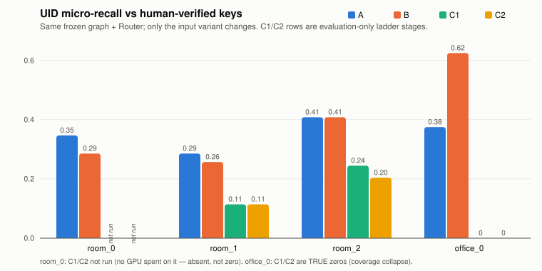
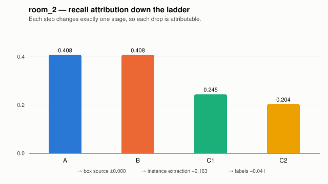
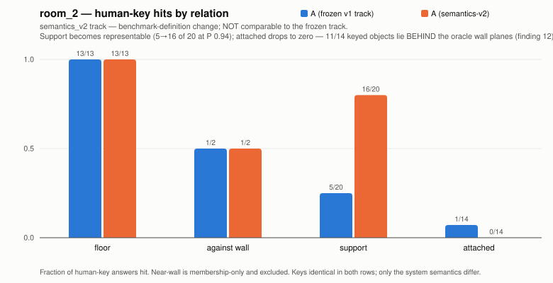

# Results — an evidence-first spatial-graph reasoner for captured 3D scenes

Release: `mvp-v1.0`. This is the publication-ready results narrative for
the frozen MVP. Every number is committed and hash-pinned; every empirical
claim names its evidence source. The scope is intentionally narrow:

> **A modular, queryable spatial-graph reasoner over captured 3D
> scenes that exposes uncertainty and isolates failures under imperfect
> 3D instance extraction.** It does not claim to solve raw-scene QA, and
> a strong end-to-end NeRF/3DGS claim would require a real reconstruction
> adapter plus learned semantics — neither is claimed.

## Abstract

Given a captured indoor scene, the system builds a typed spatial scene
graph (support, wall contact/proximity, attachment, directional) and
answers structural questions through a compile → execute → verbalize
Router with four honest outcomes: answer, grounded empty, defer, unknown.
The contribution is an evidence architecture rather than a headline
accuracy claim: an input ladder in which each variant changes one upstream
stage; human-verified keys that describe reality rather than system output;
predeclared experiments that are allowed to fail; and end-to-end provenance
from every citation to hash-pinned inputs. Across four human-keyed Replica
scenes, the ladder assigns observed answer changes to box construction,
instance extraction, or labels. An interactive viewer renders those changes
on the source mesh, turning aggregate losses into inspectable failure cases.

## Scope of the claim

**Demonstrated:** deterministic structural QA over four human-keyed captured
scenes; stage-isolated A/B/C1/C2 comparisons; explicit uncertainty states;
inspectable provenance from an answer to 3D evidence; a gate-passing
multi-view 2D-to-3D proposal generator that removes the measured
perception bottleneck (evaluation-only); and the measured relocation of
the QA bottleneck from perception to relation semantics.

**Not demonstrated:** a deployable raw-scene QA system, learned geometry and
semantics end to end, cross-dataset generalization, or a NeRF/3DGS backend.
Replica supplies the reconstruction, and C1/C2 use declared evaluation-only
oracle injections. These boundaries are part of the result, not caveats to
hide.

## The ladder and headline numbers

| variant | changes | labels |
|---|---|---|
| A | oracle boxes (`info_semantic.json`) | oracle |
| B | boxes re-derived from the semantic mesh | oracle |
| C1 | learned instances (Mask3D, frozen @0.2) on raw `mesh.ply` | oracle via exact vertex correspondence (evaluation-only) |
| C2 | = C1 instances | zero-shot CLIP on instance point-splats (evaluation-only) |

*(Figure: uid micro-recall vs human-verified keys; `runs/mvp_v0/
aggregate.json`. room_0's C1/C2 are absent — not run, never rendered as
zero; office_0's C1/C2 are true zeros.)*

*(Figure: room_2, each ladder step isolates one stage: box source costs
nothing, instance extraction costs −0.163, labels −0.041.)*

Companion metrics (both defined in `docs/c2_matched_labels_protocol.md`):
**uid micro-P/R** score UID/structural membership (the key cites uids);
**semantic citation** scores whether uid-correct citations also carry the
canonical label — C1 rows score 1.0 by construction (a scorer
self-check), C2 rows score 0.31–0.62.

The practical value of the ladder is diagnostic. A failed answer alone does
not reveal whether perception, graph construction, relation semantics, or
language caused the failure. Here, each transition holds the downstream
system fixed, so the changed stage becomes the testable explanation.

## Findings (each with its evidence source)

1. **Instance proposal coverage is the binding constraint.** Only ~32%
   of oracle entities have any viable raw Mask3D mask (IoU ≥ 0.5), and
   Mask3D's selection stage is near-optimal (2/20 viable masks wasted on
   room_2) — its ceiling is proposals, not composition
   (`docs/c1_closeout.md`).
2. **Fragment assembly of saved masks is measurably dead.** Oracle-guided
   greedy unions of 2–8 masks add ZERO entity recall at IoU 0.5 on
   either backend; the achievable ceiling is pure mask selection
   (`docs/c1_composition_ceiling.md`).
3. **The selection ceiling is real but unreachable with structural
   signals.** The 30/53 jointly-compatible ceiling (uid-P 0.93 / R 0.29
   vs the human key) exists — but three predeclared oracle-free rule
   versions (scores, sizes, overlap structure, corroboration, retained
   fractions) all failed their gates; backend confidence is
   anti-correlated with mask quality (23/30 winning masks score below
   the frozen threshold). Closing the gap needs new evidence classes
   (`docs/c1_m2c_protocol.md`).
4. **Backend choice beat every repair attempt.** Mask3D @0.2 (uid-P 1.00
   / R 0.24 on room_2's human key) outperformed the Segment3D swap
   (failed 4/5 gate criteria) and all three selection-repair rules
   (`docs/c1_m2_protocol.md`, `docs/c1_m2c_protocol.md`).
5. **Labels are learnable for anchors but not robustly.** Zero-shot CLIP
   reached 9/10 on room_2's support-owner labels yet 2/7 on the office_0
   transfer (overall top-1 0.25–0.57); a single shelf→vent error erased
   room_2's support answers. Labels are not the current bottleneck —
   but only because C1 coverage already dominates
   (`docs/c2_matched_labels_protocol.md`).
6. **Representation limits cap even perfect inputs.** Variant A with
   oracle boxes reaches only R 0.29–0.41: whole-object AABBs cannot
   model seat surfaces (15/20 room_2 support answers unreachable), the
   2 cm attachment band cannot see human "attached" (≈1/14 for every
   variant), and the support-class allowlist misses cabinet/nightstand
   (`eval/questions/phase8/REVIEW_GUIDE.md`, scorecard).
7. **Honest outcomes are load-bearing.** "Empty ≠ absent" under the
   oracle completeness profile, "not run ≠ 0" in every table, and keys
   that the system fails are recorded as successful reviews.
8. **Mesh-derived structural surfaces fail structurally, not
   parametrically — and the failure arc is itself a methods result.**
   Three successively cheaper attempts closed the mesh-plane estimator
   family: C3.0-S stopped at its input contract (the pinned mesh is
   quads; the frozen parser was triangles-only); C3.0-SR fixed the
   parser under a predeclared rule and then failed all seven geometry
   gates (14/15 grown components rejected by acceptance constants never
   measured against real roughness); the read-only Stage 0m measurement
   then showed no constant could work — floor and ceiling cohere
   (coverage 0.96/0.99) but two of four room_2 walls reach only
   0.03–0.04 coverage at ANY residual band up to 5 cm, because the
   sensor mesh records shelving/blinds rather than the architectural
   wall, and blinds form their own ≥2.2 m² planes
   (`docs/c3_0_mesh_surfaces_protocol.md`,
   `docs/c3_0_sr_mesh_surfaces_protocol.md`,
   `docs/c3_stage0m_measurement_protocol.md`). Each failure was caught
   earlier and cheaper than the last, ending with a zero-GPU
   measurement that replaced a third premature freeze.
9. **The oracle's own surface annotations disagree with the captured
   geometry.** Stage 0m's impostor census found large planar components
   belonging to the walls THEMSELVES (5.7–5.8 m²) sitting more than
   5 cm from their oracle annotation planes on 2 of 4 room_2 walls.
   Every ladder row (A, B, C1, C2) inherits those annotation planes, so
   some measured wall-contact recall limits are partly annotation
   artifacts: the 2–3 cm contact bands sit on planes with larger error
   than the bands themselves. Keys and scores are deliberately NOT
   revised — comparability is preserved and the mismatch is recorded
   here as a limitation of the oracle target definition, not repaired
   post hoc.
10. **Multi-view 2D evidence fixes the proposal ceiling — the first
   gate-passing performance experiment.** Rendering the raw mesh from
   40 fixed cameras and lifting SAM 2.1's class-agnostic 2D masks back
   through per-pixel vertex id buffers, fused by cross-view
   co-membership over mesh edges, raised single-proposal entity
   viability from 20/53 to 33/53 on the development scene and
   transferred to both prospective scenes (+6 and +5 entities) with
   zero scene-specific settings — under predeclared gates, one
   inference run per scene (~30 s of A100 each). The recovered
   population is exactly the wall-mounted/small clutter every 3D
   geometry backend failed to propose: blinds, vents, switches,
   wall-plugs, plates, lamps, vases at IoU 0.61–0.95
   (`docs/c1_p1_multiview_proposals_protocol.md`). Proposals are
   evaluation-only: no QA number changed.
11. **With proposals fixed, the QA bottleneck measurably moved to
   relation semantics.** The oracle-guided ceiling of the pooled
   proposal bank materializes 31/53 entities at QA precision 1.00 —
   and lifts human-keyed recall only 0.245 → 0.265 (support 2 → 3): of
   the 13 newly recoverable entities, exactly ONE becomes a citable
   answer. The full accounting: seven are attached-key positives
   blocked by the frozen 2 cm attachment semantics (which cannot cite
   them even from perfect geometry — variant A: 1/14); three are
   furniture-support positives, of which one materialized as the new
   support hit; one is cited only by the non-exhaustive near-wall
   question (outside micro-recall by definition); and two are not
   key-cited at all. The predeclared proceed rule stopped
   the composer before a single parameter existed
   (`docs/c1_p2_composer_protocol.md`). For the first time in the
   project, perception is not the binding constraint — the
   representation layer is, and that relocation is itself the arc's
   concluding measurement.
12. **Semantics are partly representable — and partly blocked by the
   annotations themselves.** A separately labeled semantics-v2 track
   (definitions frozen before scoring; every key and frozen row
   preserved and hash-guarded) re-ran variant A first. Its
   contained-rest support definition WORKS on the development scene —
   room_2 support answers went 5/20 → 16/20 at precision 0.94 — but is
   poorly calibrated across scenes (precision 0.36/0.58 on
   office_0/room_1, the declared interior-volume property at real
   cost). Attachment scored ZERO: a census of all 14 human-keyed
   attached objects shows 11 lie BEHIND the oracle wall planes
   (signed gaps −0.16 to −1.23 m — the finding-9 annotation
   displacement measured from the A side), the three contact-passing
   vents carry 0.37–0.62 m-deep annotation boxes, and one keyed vent
   sits 1.26 m from every wall: "attached" in the keys is a semantic
   judgment about wall fixtures, not a box-proximity property
   recoverable from Replica annotations. The frozen relation-specific
   gates stopped the track — notably, the aggregate gates alone
   (micro-R 0.612 @ P 0.94) would have PASSED; only the per-relation
   gates caught the failure, empirically vindicating that review
   requirement (`docs/semantics_v2_track_protocol.md`).

## The causal chain, end to end

Read together, findings 10–12 form a complete measured causal result —
each link established under predeclared gates, each hand-off measured
rather than assumed:

1. Proposal coverage was the binding constraint → **C1-P1 fixed it**
   (33/53 dev, transferred twice, evaluation-only).
2. With proposals fixed → **relation semantics became binding**
   (P2.0: oracle-guided composition moves recall 0.245 → 0.265).
3. With semantics redefined → **support is representable but poorly
   calibrated across scenes; attachment is not recoverable from
   annotation-box proximity at all** (semantics-v2 S2).
4. Throughout → **relation-specific gates prevented a misleading
   aggregate pass** at the exact moment an aggregate would have lied.

*(Figure: the finding-12 decomposition on room_2 — floor and
against-wall unchanged, support 5/20 → 16/20 under the contained-rest
definition, attached 1/14 → 0/14 because the keyed fixtures sit behind
the annotation planes. semantics_v2 track; benchmark-definition change;
`runs/semantics_v2/s2_report.json`.)*

## Negative results (committed as first-class artifacts)

Segment3D pilot (predeclared gate, stopped after one scene); three
selection-repair rule versions (stopped at budget, holdout unspent);
query-scoped proposal expansion (zero recovered answers, 645→1360 edge
inflation); uncertainty-preserving proposal pool (policy prototype only);
C2 vocabulary hygiene explicitly rejected as post-hoc tuning; the
mesh-plane surface-estimator family (C3.0-S input-contract failure,
C3.0-SR seven-gate failure, Stage 0m OVERLAP verdict — closed with
transfer budgets unspent both times).

## Limitations

Four human-keyed scenes, one dataset (Replica), one reconstruction
source; C1/C2 inject oracle labels/surfaces respectively as declared
evaluation scaffolding; the C2 vocabulary is closed-set (declared leak);
near-wall questions are membership-only; frl_apartment_0 remains
plausibility-only; the compiler is a rules engine with a known
paraphrase-brittleness surface (measured separately). The oracle
structural-surface planes themselves are annotation targets that the
captured geometry contradicts by more than 5 cm on 2 of 4 room_2 walls
(finding 9): wall-contact metrics throughout should be read against
that target uncertainty, and keys/scores were intentionally left
unrevised to preserve comparability. Replica's raw mesh format is also
not uniform across scenes (three scenes are pure quads, one pure
triangles) — a reminder that even "one dataset" hides input-contract
variance. Finding 12 extends the annotation caveat to objects: the
keyed attachment answers are unrecoverable from Replica's annotation
boxes (11/14 behind the wall planes), so the frozen track's near-zero
attachment recall is a property of the dataset's annotation geometry
as much as of the system — and the semantics-v2 support definition,
though validated on the development scene, is reported with its
measured cross-scene precision collapse, not just its dev-scene win.

## Future work (explicitly NOT part of this release)

Two successor experiments are identified but deliberately unopened,
each requiring its own predeclared protocol: (1) **D2 precision
hardening** — the contained-rest support definition validated on the
development scene needs an over-fire guard for interior-volume false
positives before it can hold its cross-scene precision floor; (2)
**annotation-aware attachment** — recovering the keyed attachment
answers requires evidence that tolerates fixtures annotated at or
beyond the wall planes (embedded-in-plane semantics), a new definition
class rather than a constant change. Both are future work; this
release's experimental arc is closed.

## Artifacts

- `python3 tools/mvp_demo.py` — deterministic A/B/C1/C2 report vs human
  keys (byte-identical, hard reference checks).
- `python3 tools/mvp_viewer.py` — self-contained 3D evidence viewer
  (office_0 + room_2), owner-accepted.
- `python3 tools/mvp_captioned_demo.py` — presentation-only, self-running
  captioned walkthrough derived from the accepted viewer; no answers or
  metrics are recomputed. Output: `runs/mvp_v1/captioned_demo.html`.
- Manual recording script: `docs/mvp_walkthrough.md`.
- Reproduction manifest: `docs/reproduction.md`; artifact pins:
  `docs/c1_artifact_manifest.json`, `tools/replica_scenes.lock.json`,
  `eval/predictions/phase8_c2/`.
- C1-P1 proposal pipeline: `tools/c1p1_render.py` / `c1p1_fuse.py` /
  `c1p1_eval.py` + `notebooks/c1p1_sam2_colab.ipynb`; frozen banks
  pinned in `docs/c1_artifact_manifest.json` (`c1p1_proposal_banks`);
  P2.0 ceiling: `tools/c1p2_ceiling.py`; semantics-v2 track:
  `demo/semantics_v2.py` + `tools/semantics_v2_s2.py` (v2 extractors
  under `graph/relations/*_v2.py`, frozen-track hash guards in
  `tests/tools/test_semantics_v2_guards.py`).
- Release tag: `mvp-v1.0` (the MVP freeze; findings 8–11 postdate it).
- Canonical tests: `python3 tools/run_tests.py`.
